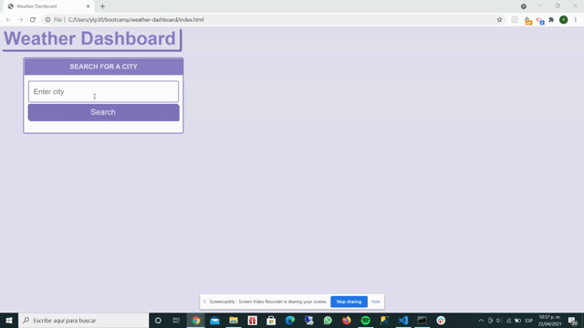

# Weather Dashboard
**Displays the weather of the city you are looking for .**
\
&nbsp;
## Description
Third-party APIs allow developers to access their data and functionality by making requests with specific parameters to a URL. Developers are often tasked with retrieving data from another application's API and using it in the context of their own. Your challenge is to build a weather dashboard that will run in the browser and feature dynamically updated HTML and CSS.

Use the OpenWeather One Call API to retrieve weather data for cities and Position Stack to retrieve longitude and latitude data. Read through the documentation for setup and usage instructions. You will use localStorage to store any persistent data. 

## Requirements
This proyect  requires no modules outside of the core.

## Installation
* Go to the following link [https://github.com/Yazmin30-bot/weather-dashboard](https://github.com/Yazmin30-bot/weather-dashboard/) and clone the link 

* Go to Git-bash and page the github's with the following code `$ git clone https://github.com/Yazmin30-bot/weather-dashboard.git ` 

## Mock-Up

The following animation demonstrates the application functionality:

## Build with 
* [Javascript](https://www.javascript.com/) - `Javascript`
* [CSS Bootstrap Framework](https://getbootstrap.com/docs/4.3/getting-started/download/) - `CSS Advanced Framework`
* [API - One Call](https://openweathermap.org/api/one-call-api/) - `One Call API`
* [API - Current weather data](https://openweathermap.org/current/) - `Current weather data API`
\
&nbsp;

## Links
* The URL of the deployed application.
[https://yazmin30-bot.github.io/weather-dashboard/](https://yazmin30-bot.github.io/weather-dashboard/)

* The URL of the GitHub repository
[https://github.com/Yazmin30-bot/weather-dashboard/](https://github.com/Yazmin30-bot/weather-dashboard/)

## Authors 
* **`Yazmin Tinoco`**   - [Yazmin30-bot](https://github.com/Yazmin30-bot/)